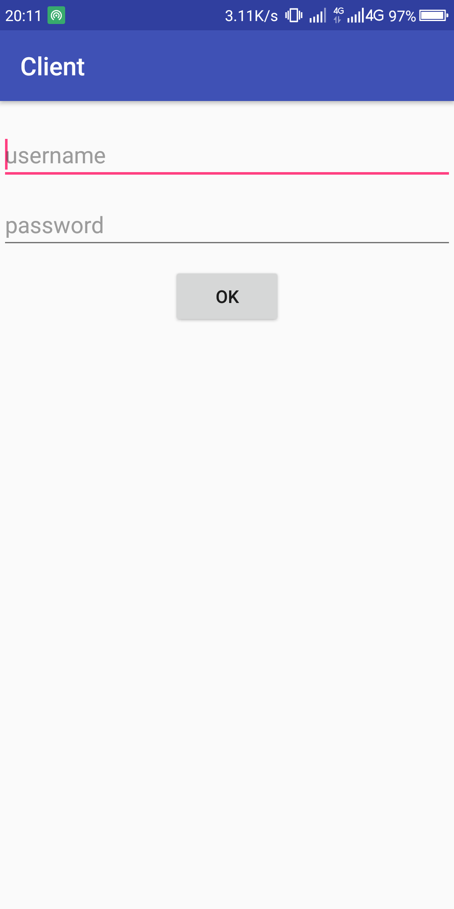
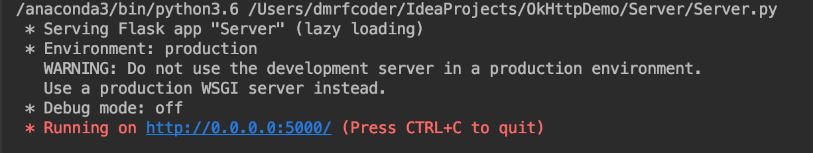
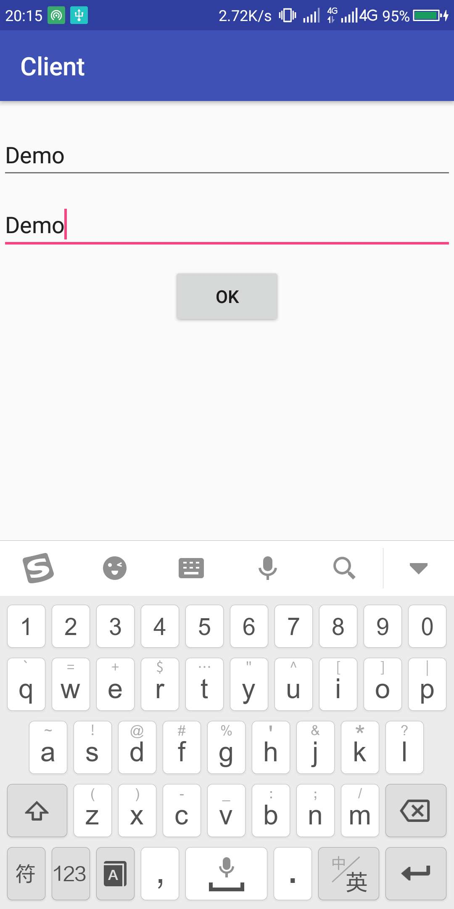
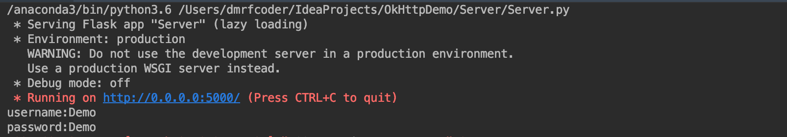

完整实现流程见[ai-exception](https://ai-exception.com/2018/06/13/%E4%BD%BF%E7%94%A8python%E6%90%AD%E5%BB%BA%E6%9C%8D%E5%8A%A1%E5%99%A8%E5%B9%B6%E5%AE%9E%E7%8E%B0Android%E7%AB%AF%E4%B8%8E%E4%B9%8B%E9%80%9A%E4%BF%A1/)

- Client-android客户端代码

  

  

- server-服务端python代码

  运行起来之后如下图所示：

  

在客户端输入用户名和密码之后点击ok发送，即可在服务端接收到对应信息：

服务端的输出：

